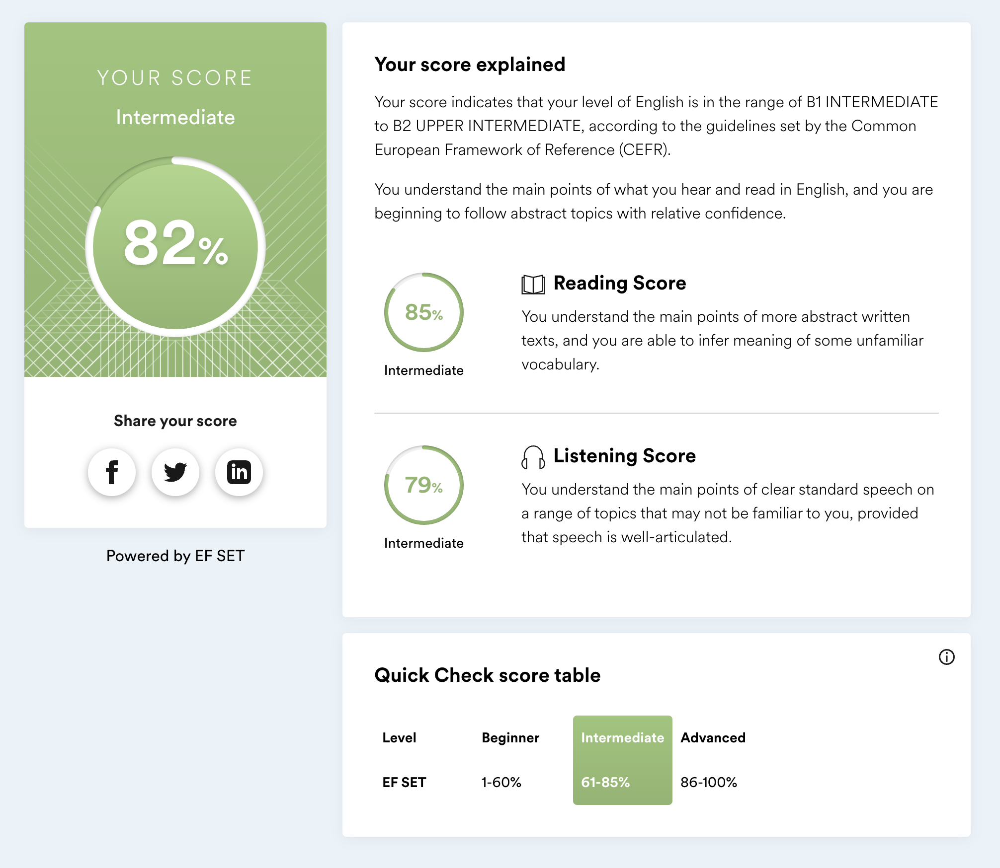

# Mikhail Kovalev


## Contacts

* +7 (960) 060-30-10
* kovalev094@gmail.com
* Discord - Mikhail Kovalev (Wrestler094)#5907

## About me

Student of 21 programming School from Sberbank.

My goal is to become Senior Frontend Developer.

## Skills

* Git
* HTML
* CSS
* SCSS
* JS
* TS
* React
* Redux
* Node.js

## Code samples

JS code sample

```
function solution(matrix) {
    const rowsNumber = matrix.length; 
    const colsNumber = matrix[0].length;
    const res = [];
    
    for (let i = 0; i < colsNumber; i++) {
        for (let j = 0; j < rowsNumber; j++) {
            if (matrix[j][i] === 0) {
                break;
            } else {
                res.push(matrix[j][i]);
            }
        }
    }
    
    return res.reduce((total, item) => total += item, 0);
}
```

C++ code sample

```
int solution(vector<vector<int>> matrix) {
int rows_number = matrix.size();
int cols_number = matrix[0].size();
int result = 0;

    for (int i = 0; i < cols_number; i++) {
        for (int j = 0; j < rows_number; j++) {
            if (matrix[j][i] == 0) {
                break;
            } else {
                result += matrix[j][i];
            }
        }
    }
    
    return result;
}
```

## Experience

### Trainee React-developer

Noorsoft - Dec 2021 — Feb 2022

I worked on chat app for tech support on React/Redux/Redux-saga/Firebase stack. 
Additional, I got to know and used Jest, Bootstrap, Formik, Pubnub, dotenv, prettier, lodash, react-infinite-scroller libraries.

## Education

### 21 School - 2022 - to current time

Student of programming school 21

### Innopolis University - 2021

Junior Frontend Developer

### VRUST - 2012-2018

Bachelor and Master Degrees in 
Physical culture and Sport management

## English

